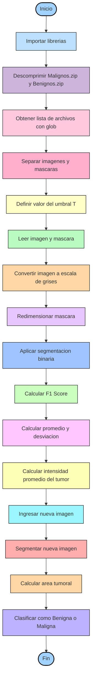

# PARCIAL-IMAGENES-DIAGNOSTICAS.
**DIAGRAMA DE FLUJO** 

**DESCRIPCION DE LOS RESULTADOS OBTENIDOS** 

En este proyecto se implementó un algoritmo de segmentación por umbral para la detección de lesiones tumorales en imágenes médicas. Se evaluó el desempeño del método utilizando la métrica F1 Score, comparando las segmentaciones obtenidas con las máscaras reales (ground truth).

Se probaron distintos valores de umbral (T = 40, 55, 60 y 80) con el fin de analizar cómo afecta la segmentación al desempeño del modelo. Se calcularon el promedio y la desviación estándar del F1 Score para cada caso, permitiendo identificar el umbral que ofrece mejor equilibrio entre precisión y sensibilidad.

Los resultados muestran que el desempeño del modelo depende directamente del valor del umbral. Un umbral demasiado alto o demasiado bajo puede generar sobre-segmentación o sub-segmentación, afectando negativamente la métrica F1.

Adicionalmente, se calculó la intensidad promedio de los píxeles correspondientes a la región tumoral, lo que permitió analizar características estadísticas del tumor.

Finalmente, se implementó una regla de decisión simple basada en el porcentaje de área tumoral segmentada. Si el área supera el 25% del total de la imagen, se clasifica como maligna; en caso contrario, como benigna.

**Explicación detallada del enfoque y métodos implementados**
El enfoque utilizado se basa en técnicas clásicas de procesamiento digital de imágenes:
a) Carga y organización de datos
Se descomprimieron los conjuntos de imágenes (Malignos y Benignos) y se organizaron automáticamente utilizando la función glob, separando imágenes originales y sus respectivas máscaras.

b) Preprocesamiento
Cada imagen fue convertida a escala de grises mediante cv2.cvtColor. Esto simplifica el análisis al trabajar únicamente con intensidades en lugar de tres canales de color.
c) Segmentación por umbral
Se aplicó una segmentación binaria basada en un umbral fijo:

$$
binary =
\begin{cases}
1 & \text{si } gray < T \\
0 & \text{en otro caso}
\end{cases}
$$

Este método permite identificar regiones de menor intensidad asociadas a posibles lesiones.
d) Evaluación mediante F1 Score
Para medir el desempeño de la segmentación, se utilizó la métrica F1 Score, que combina precisión y sensibilidad:


La comparación se realizó entre la máscara real y la máscara segmentada.

e) Análisis estadístico

Se calcularon:
Promedio del F1 Score
Desviación estándar
Intensidad promedio del tumor.

Esto permitió evaluar la estabilidad del método.

f) Clasificación simple
Se implementó una regla basada en el porcentaje de área tumoral:


Si el porcentaje es mayor a 0.25 → Maligna
Si es menor o igual → Benigna
**EXPLICACION DE LINEAS DE CODIGO**

Para empezar se importaron las librerias y funciones necesarias
```python
import cv2
import numpy as np
import matplotlib.pyplot as plt
import glob
from sklearn.metrics import f1_score
from google.colab.patches import cv2_imshow
```

despues descomprimimos las carpetas que contienen las imagenes de los tumores beningnos, malignos y sus respectivas mascaras.
```python
!unzip Malignos.zip
!unzip Benignos.zip
```
Aqui se buscan los archivos .png y se separan entre mascara e imagen. Después imprime la cantidad de imagenes y de mascaras para comprobar que se hayan filtrado adecuadamente. Al final se crea una lista vacia para después guardar los datos de los F1 Scores.
```python
all_files = sorted(glob.glob("*.png"))
image_paths = [f for f in all_files if "_mask" not in f]
mask_paths  = [f for f in all_files if "_mask" in f]
print("Imágenes:", len(image_paths))
print("Máscaras:", len(mask_paths))

scores = []

```
Ahora para la segmentación se empieza probando un umbral T = 80, realizando un for para procesar las 60 imagenes, se convierte la imagen a escala de grises, y se redimensiona la mascara para que tenga el mismo tamaño que la imagen con `  mask = cv2.resize(mask, (gray.shape[1], gray.shape[0]))`. Se aplica la segmentación con umbral y se convierten con `flatten` de matrices 2D a vectores 1D para aplicar la función `f1_score`.
```python
T=80
for i in range(len(image_paths)):
  img = cv2.imread(image_paths[i])
  mask = cv2.imread(mask_paths[i], 0)
  gray = cv2.cvtColor(img, cv2.COLOR_BGR2GRAY)
  mask = cv2.resize(mask, (gray.shape[1], gray.shape[0]))


  binary = np.zeros_like(gray)
  binary[gray < T] = 1
  mask = mask // 255

  f1 = f1_score(mask.flatten(), binary.flatten())
  scores.append(f1)

print("Promedio F1:", np.mean(scores))
print("Desviación estándar:", np.std(scores))

```
Ahora para la segmentación se empieza probando un umbral T = 80, realizando un for para procesar las 60 imagenes, se convierte la imagen a escala de grises, y se redimensiona la mascara para que tenga el mismo tamaño que la imagen con `mask = cv2.resize(mask, (gray.shape[1], gray.shape[0]))`. Se aplica la segmentación con umbral y se convierten con `flatten` de matrices 2D a vectores 1D para aplicar la función `f1_score`.
```python
T=80
for i in range(len(image_paths)):
  img = cv2.imread(image_paths[i])
  mask = cv2.imread(mask_paths[i], 0)
  gray = cv2.cvtColor(img, cv2.COLOR_BGR2GRAY)
  mask = cv2.resize(mask, (gray.shape[1], gray.shape[0]))


  binary = np.zeros_like(gray)
  binary[gray < T] = 1
  mask = mask // 255

  f1 = f1_score(mask.flatten(), binary.flatten())
  scores.append(f1)

print("Promedio F1:", np.mean(scores))
print("Desviación estándar:", np.std(scores))
```
Promedio F1: 0.19928292879913367
Desviación estándar: 0.196648717723429

Para encontrar el mejor procesamiento se prueban distintos valores de T (umbral) hasta encontrar los mejores valores de F1 y desviación estándar.
Se aplican los umbrales "40, 55 y 60". 
```python
T=40

for i in range(len(image_paths)):
  img = cv2.imread(image_paths[i])
  mask = cv2.imread(mask_paths[i], 0)
  gray = cv2.cvtColor(img, cv2.COLOR_BGR2GRAY)
  mask = cv2.resize(mask, (gray.shape[1], gray.shape[0]))


  binary = np.zeros_like(gray)
  binary[gray < T] = 1
  mask = mask // 255

  f1 = f1_score(mask.flatten(), binary.flatten())
  scores.append(f1)

print("Promedio F1:", np.mean(scores))
print("Desviación estándar:", np.std(scores))
```
Promedio F1: 0.19152608869768337
Desviación estándar: 0.20514189571609265

El umbral de 55 dió los mejores resultados, por lo cual se escogió como el código final. A este codigo se le complementó la visualización de cada imagen segmentada con `matplotlib` y su F1 Score respectivo.
```python
T=55

for i in range(len(image_paths)):
  img = cv2.imread(image_paths[i])
  mask = cv2.imread(mask_paths[i], 0)
  gray = cv2.cvtColor(img, cv2.COLOR_BGR2GRAY)
  mask = cv2.resize(mask, (gray.shape[1], gray.shape[0]))


  binary = np.zeros_like(gray)
  binary[gray < T] = 1
  mask = mask // 255

  f1 = f1_score(mask.flatten(), binary.flatten())
  scores.append(f1)

  plt.imshow(binary, cmap='gray')
  plt.title(f'Imagen segmentada {i+1} - F1: {f1:.2f}')
  plt.axis('off')
  plt.show()

print("Promedio F1:", np.mean(scores))
print("Desviación estándar:", np.std(scores))
```
Promedio F1: 0.19959456226063915
Desviación estándar: 0.19649696088820517

```python
T=60

for i in range(len(image_paths)):
  img = cv2.imread(image_paths[i])
  mask = cv2.imread(mask_paths[i], 0)
  gray = cv2.cvtColor(img, cv2.COLOR_BGR2GRAY)
  mask = cv2.resize(mask, (gray.shape[1], gray.shape[0]))


  binary = np.zeros_like(gray)
  binary[gray < T] = 1
  mask = mask // 255

  f1 = f1_score(mask.flatten(), binary.flatten())
  scores.append(f1)

print("Promedio F1:", np.mean(scores))
print("Desviación estándar:", np.std(scores))
```
Promedio F1: 0.1886185514736362
Desviación estándar: 0.2016104178524424

Como los valores tanto de F1 Score como de desviación estándar no están dando los resultados esperados, se incluye esta sección de código donde se comprueba cual es la intensidad promedio del tumor y la desviación estandar para elegir el umbral optimo.
```python
valores_tumor = []

for i in range(len(image_paths)):
    imagen = cv2.imread(image_paths[i])
    mask = cv2.imread(mask_paths[i], 0)

    gray = cv2.cvtColor(imagen, cv2.COLOR_BGR2GRAY)
    mask = cv2.resize(mask, (gray.shape[1], gray.shape[0]))

    tumor_pixels = gray[mask == 255]
    valores_tumor.extend(tumor_pixels)

print("Media intensidad tumor:", np.mean(valores_tumor))
print("Desviación:", np.std(valores_tumor))
```
Media intensidad tumor: 53.95745975739419
Desviación: 42.95237497623277

Analizando estos valores se puede concluir que el umbral optimo para segmentar el tumor debe ser de alrededor 53.95, sin embargo, la desviación estándar es demasiado alta, lo cual significa que están muy dispersos los datos. Hay tumores con intensidades muy altas, y otros con muy bajas. Por eso aunque se aplique el umbral optimo, los resultados no serán ideales pues los datos estas muy dispersos con respecto a la media.

```python
import cv2
import numpy as np

T = 55  # mismo umbral que usas

# Persona ingresa la ruta
ruta = input("Ingrese la ruta de la imagen: ")

img = cv2.imread(ruta)
gray = cv2.cvtColor(img, cv2.COLOR_BGR2GRAY)

# Segmentación
binary = np.zeros_like(gray)
binary[gray < T] = 1

# Calcular área de la lesión
area = np.sum(binary)
area_total = binary.shape[0] * binary.shape[1]
porcentaje = area / area_total

# Regla simple de decisión
if porcentaje > 0.25:
    print("La imagen es: MALIGNA")
else:
    print("La imagen es: BENIGNA")
```
Este código realiza una clasificación simple de imágenes médicas basada en segmentación por umbral. Primero, se importan las `librerías cv2` y `numpy`, necesarias para procesar la imagen y realizar operaciones matriciales. Luego se define el umbral `T = 55`, que permitirá separar la posible lesión del resto de la imagen.
El programa solicita al usuario la ruta de la imagen `(input)` y la carga con `cv2.imread`. Posteriormente, la imagen se convierte a escala de grises usando `cv2.cvtColor`, lo que facilita el análisis de intensidades.
Después, se crea una imagen binaria donde los píxeles con intensidad menor que el umbral `(gray < T)` se consideran parte de la lesión. Con esta segmentación, se calcula el área tumoral sumando los píxeles blancos `(np.sum(binary))` y se obtiene el porcentaje respecto al área total de la imagen.
Finalmente, se aplica una regla de decisión: si el porcentaje de área tumoral es mayor al 25%, la imagen se clasifica como maligna; en caso contrario, se clasifica como benigna.

**TABLA DE F1-SCORES DE LA SEGMENTACION**

[Tabla.F1.-.Hoja.1.csv](https://github.com/user-attachments/files/25672992/Tabla.F1.-.Hoja.1.csv)
[Tabla.F1.-.Hoja.1.csv](https://github.com/user-attachments/files/25672992/Tabla.F1.-.Hoja.1.csv)
