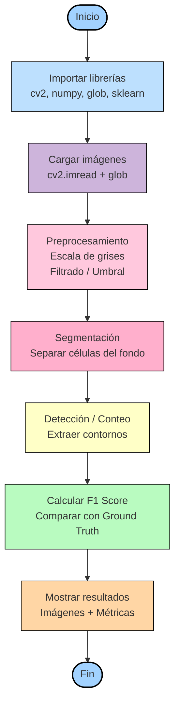

# PARCIAL-IMAGENES-DIAGNOSTICAS



Para empezar se importaron las librerias y funciones necesarias
```python
import cv2
import numpy as np
import matplotlib.pyplot as plt
import glob
from sklearn.metrics import f1_score
from google.colab.patches import cv2_imshow
```

despues descomprimimos las carpetas que contienen las imagenes de los tumores beningnos, malignos y sus respectivas mascaras.
```python
!unzip Malignos.zip
!unzip Benignos.zip
```
Aqui se buscan los archivos .png y se separan entre mascara e imagen. Después imprime la cantidad de imagenes y de mascaras para comprobar que se hayan filtrado adecuadamente. Al final se crea una lista vacia para después guardar los datos de los F1 Scores.
```python
all_files = sorted(glob.glob("*.png"))
image_paths = [f for f in all_files if "_mask" not in f]
mask_paths  = [f for f in all_files if "_mask" in f]
print("Imágenes:", len(image_paths))
print("Máscaras:", len(mask_paths))

scores = []

```
