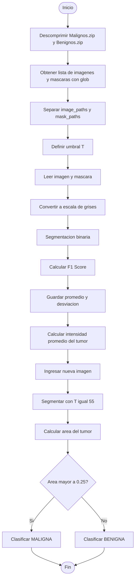

# PARCIAL-IMAGENES-DIAGNOSTICAS



Para empezar se importaron las librerias y funciones necesarias
```python
import cv2
import numpy as np
import matplotlib.pyplot as plt
import glob
from sklearn.metrics import f1_score
from google.colab.patches import cv2_imshow
```

despues descomprimimos las carpetas que contienen las imagenes de los tumores beningnos, malignos y sus respectivas mascaras.
```python
!unzip Malignos.zip
!unzip Benignos.zip
```
Aqui se buscan los archivos .png y se separan entre mascara e imagen. Después imprime la cantidad de imagenes y de mascaras para comprobar que se hayan filtrado adecuadamente. Al final se crea una lista vacia para después guardar los datos de los F1 Scores.
```python
all_files = sorted(glob.glob("*.png"))
image_paths = [f for f in all_files if "_mask" not in f]
mask_paths  = [f for f in all_files if "_mask" in f]
print("Imágenes:", len(image_paths))
print("Máscaras:", len(mask_paths))

scores = []

```
Ahora para la segmentación se empieza probando un umbral T = 80, realizando un for para procesar las 60 imagenes, se convierte la imagen a escala de grises, y se redimensiona la mascara para que tenga el mismo tamaño que la imagen con `  mask = cv2.resize(mask, (gray.shape[1], gray.shape[0]))`. Se aplica la segmentación con umbral y se convierten con `flatten` de matrices 2D a vectores 1D para aplicar la función `f1_score`.
```python
T=80
for i in range(len(image_paths)):
  img = cv2.imread(image_paths[i])
  mask = cv2.imread(mask_paths[i], 0)
  gray = cv2.cvtColor(img, cv2.COLOR_BGR2GRAY)
  mask = cv2.resize(mask, (gray.shape[1], gray.shape[0]))


  binary = np.zeros_like(gray)
  binary[gray < T] = 1
  mask = mask // 255

  f1 = f1_score(mask.flatten(), binary.flatten())
  scores.append(f1)

print("Promedio F1:", np.mean(scores))
print("Desviación estándar:", np.std(scores))
```

